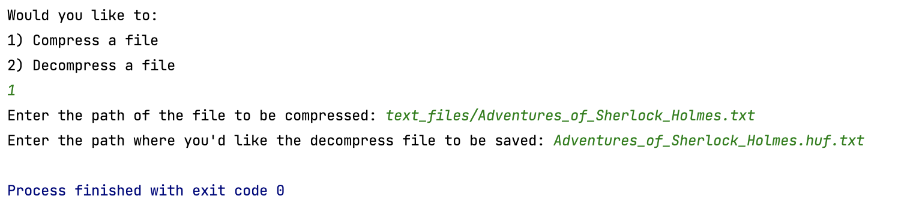
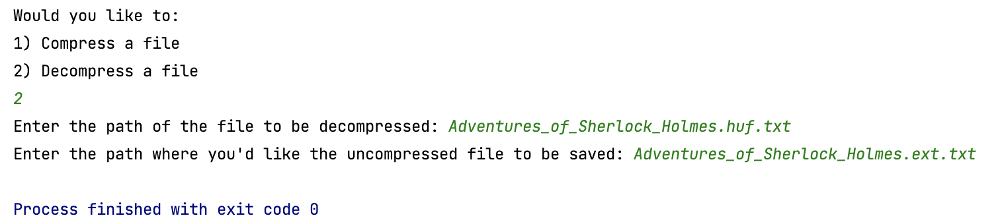

# Huffman Coding Lab

For this lab assignment you are going to create a text file compression program.  To accomplish this us the Huffman tree as described in the Huffman Coding Handout by Owen L. Astrachan and Chapter 30.1 of your text.  

Your program should ask the user if they wish to encode or decode a file, then prompt the user for the file path of the file to open, then prompt the user for a filename to save the new file under.  It should then open the file encode or decode the content and save it to the new file path entered.  

If you code your program well you should be able to compress the larger text file examples to almost half their original size. 

## Developing and testing:
This time there are no automated tests for you to use or any starting code, it's all up to you.  I might recommend starting with a Huffman ADT class with encode and decode interface methods, but it's up to you. You can and should use STD Container libraries for Hash Tables, Unordered Lists, Priority Queues if you need them, but you ***must code the Huffman tree yourself***. I've included a few example files you can use to test your program.  

Below in this ReadMe file add a short description of how to use your program and how it is implemented.  Include some results from your compression tests, how much are you able to compress a large text file? 

## Your program needs to:

1. Ask the user if they want to compress of decompress a file.  
2. Get input file path.
3. Get a path to save the new compressed or decompressed file.
4. And then exit.  Your program should **not** remain open between compression and decompression sessions. 

### Example of running the program to compress a file:

### Example of running the program to decompress a file:

## Writing to a binary file. 
One of the things this assignment requires is that you be able to write a binary string as a binary file.  Since this is outside the scope of this class I've included a Storage Class for you to use or emulate.  The Storage driver will take Binary string chunks and store them to a binary file.  It will also open a binary file and return to you binary string chunks 8 bits at a time. It will also allow you to store and read header information that you'll need to stash and rebuild your huffman tree. See the StorageDriver.cpp for an example of how to use the Storage Class. 

## Huffman Node and using a priority queue
I've also included a Node.h file that can be used for the huffman tree or as an example.  When putting Node pointers in a stl priority queue you'll need to let the queue know how to compare two nodes.  The struct compareWeights in the Node.h file does exactly this.  You can find more information here: https://www.geeksforgeeks.org/stl-priority-queue-for-structure-or-class/

**Grading rubric 100 points for the first lab assignment**

| Points | Requirements                                                                                                                                                                                                                                                                               |
|--------|--------------------------------------------------------------------------------------------------------------------------------------------------------------------------------------------------------------------------------------------------------------------------------------------|
| 30     | Huffman Tree: You code demonstrates the ability to create a Huffman tree.                                                                                                                                                                                                                  |
| 30     | Encoding:  Your program is able to encode a string using the Huffman tree.                                                                                                                                                                                                                 |       
| 30     | Decoding: Your program is able to decode a string using the Huffman tree.                                                                                                                                                                                                                  |       
| 15     | File IO:  You program is able to open encode/decode and save a file correctly.  Including some form of storing the a representation of the huffman tree in the encoded file.                                                                                                               |        
| 15     | Large Files:  Your program is capable of handling large file by incrementally reading in the file while creating and encoding/decoding the Huffman tree.                                                                                                                                   |       
| 10     | Short write up, appended to this readme, describing both how to use your program and how it is implemented.                                                                                                                                                                                          |        
| 20     | Good coding practices, including: self-commenting variable names, one statement per line, properly indenting and spacing, good  descriptive comments, and a lack of coding errors like memory leaks. **Create documenting comments for each method public and private**  |

## Enter you description below:

to compress the file i first open it, then call a function count characters which puts the characters in a file and 
their number of occurances into a map count_char. Then i create a priority queue of nodes with values of the character 
they hold and weight which is number of occurances. then using that queue i build a huffman tree so where the leafs
of the tree are the nodes that hold characters. then i build my map "ascii" which has a character as the key
 and it holds the binary code that the character is represented by. I then create a header using this map to format
a string such as "character" followed by the "binary" followed by a delimeter so i can read later to decode.
then i read in the original text file and create a binary string of the text file to insert into a new file of binary.

to decompress i read in the header from the compressed file and use that to create a new map this time the key is 
the binary code and it represents a character, once i have this map i can begin to decode the compressed file and out
put the decoded text into a new file 